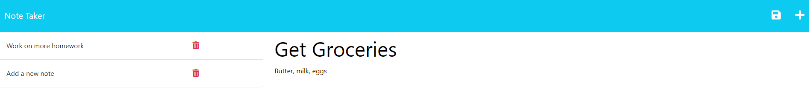

# Notes Taker

## Description

This project served as a way for me to practice and become more familiar with writing GET and POST requests. It uses the functionality of the node packages 'fs', 'path', and 'uuidv4'. It allows users to write and save notes in a simple yet readable fashion. 

## Usage

This project can be accessed by visiting [this page](https://notes-taker-app-94f83f45691b.herokuapp.com/) and should look similar to the screenshot below 

Simply click the "Get Started" button and you will be taken to the notes page. Fill out your note in the given space on the right hand side of the screen, and click on the save icon in the top right corner to save the note. You can click on saved notes from the left side of the screen to have them presented to you again.